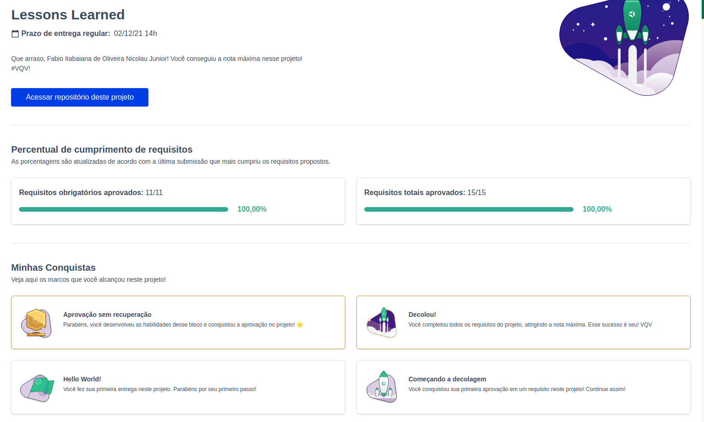

<h1>Sobre</h1>

Primeiro projeto do módulo 1 - Fundamentos, da <a href="https://betrybe.com" target="_blank">Trybe!</a>

O desafio foi criar uma página utilizando HTML e CSS com as principais lições aprendidas até aqui

<h1>Tecnologias utilizadas<h1>
<ul>
  <li>HTML<li>
  <li>CSS<li>
</ul>

<h1>Nota</h1>
